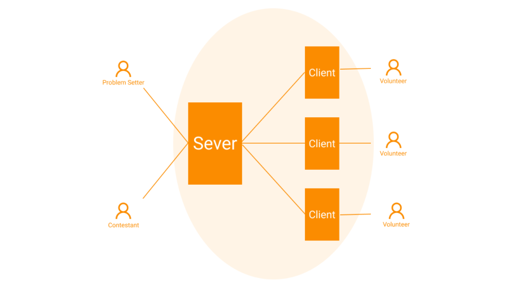

# Distributed Online Judge

Distributed Online Judge is a distributed computing application for testing programs against test cases in programming competitions.

Table of contents:
- [Team members](#team-members)
- [Why yet another online judge?](#why-yet-another-online-judge)
- [Architecture](#architecture)
- [Technology stack](#technology-stack)
- [Documentation](#documentation)
- [Challenges](#challenges)

## Team members

- Khaled Ismaeel (BS18-SB)
- Trang Nguyen (BS18-DS-01)
- Marko Pezer (BS18-SE-01)
- Kerim Kochekov (BS18-DS-02)

## Why yet another online judge?

Hosting a programming competition is a resource-intensive task. In some rounds on [Codeforces](codeforces.com) the judging servers receive an excess of 100,000 solutions to test, each of which runs on around 50 test cases taking a matter of seconds and sometimes minutes to complete. As a result, competitive programming platforms often require high performance servers to accommodate the huge workload.

Obviously, investing in powerful servers is expensive. Furthermore, this approach is error-prone due to its single point of failure. This has already been demonstrated in numerous online round on Codeforces, where the testing servers would be overloaded or DDoS'ed during competitions and the round would eventually be canceled.

This project is an attempt to port the approach of [Lichess](lichess.org)'s computer analysis feature to competitive programming platforms. Lichess employs a volunteer computing paradigm where volunteers perform game analysis on their local machines and report the results back to Lichess servers. In this paradigm the server is not involved in the computationally-intensive task of analyzing game; only in request processing. This has proved to be extremely reliable for Lichess: analysis is almost instant and perpetually available.

## Architecture

The application cluster consists of 2 types of network nodes:

- **Server** run by the platform administrator.
- **Client** run by a single volunteer.

The server hosts the platform interface to contestants along with all units related to solution testing (test cases, checker, validator, interactor, etc). When the server accepts a solution from a user, it forwards this solution along with testing units (which could be cached) to a volunteer. The client performs the testing protocol and reports the results back to the server, which in turn reports the result back to the contestant. All communication channels (contestant-server, server-volunteer) are to be implemented on top of HTTPS.



## Technology stack

**Frontend**

- React JS
- Material UI

**Backend**

- NodeJS
- MongoDB

**Testing environment** (not fully determined)

- Docker
- GDB

**Testing and documentation**

- Jest
- Swagger
- JSDoc

## Documentation

### Server

#### Setup

To get this project up and running locally on your computer:

1. Set up a [Nodejs](https://wiki.developer.mozilla.org/en-US/docs/Learn/Server-side/Express_Nodejs/development_environment) development environment.
1. Once you have node setup, enter the following commands in the root of your clone of this repo:
   ```
   #Go to server directory
   cd server

   #Install dependencies
   npm install

   #Create directory to save uploaded files
   mkdir public/uploads

   #Start development server 
   DEBUG=distributed-online-judge:* npm run devstart
   ```
1. Open a browser to http://localhost:3000/ to open the site.

> **Note:** The library uses a default MongoDb database hosted on [MongoDB Atlas](https://www.mongodb.com/cloud/atlas). You should use a different database for your own code experiments.

#### APIs

| HTML Verb | URL | Description |
|-----------|-----|-------------|
| GET | /problems | Display all available problems |
| GET | /problem/create | Show form to make new problem |
| POST | /problem/create | Add new problem to database and redirect |
| GET | /problem/:id | Show info about one problem |
| GET | /solutions | Display all available solutions |
| GET | /solution/create | Show form to make new solution |
| POST | /solution/create | Add new solution to database and redirect |
| GET | /solution/:id | Show info about one solution |


### Client


## Challenges

Yet to be written.

## Project

Project progress and planning can be found on GitHub projects page.
